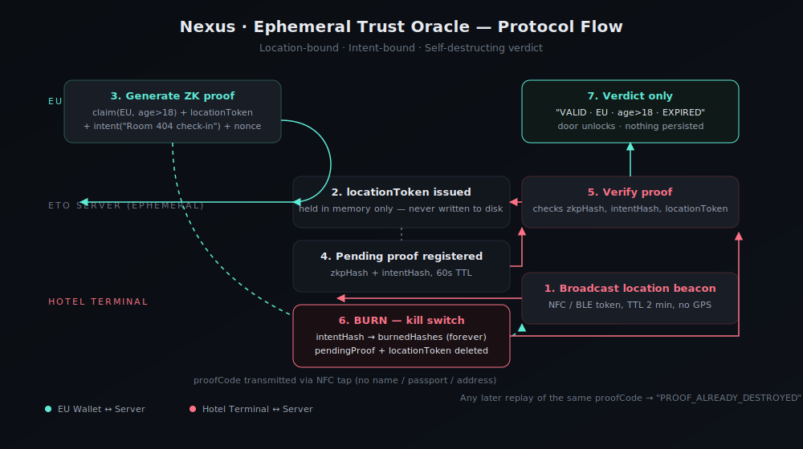

# Nexus · Ephemeral Trust Oracle (ETO)

> "Prove who you are, where you are, right now — then watch the proof vanish."

A working MVP for a cross-border identity bridge that lets someone prove a claim
(e.g. "I hold an EU ID, I'm over 18") to a verifier abroad (e.g. a hotel in Japan)
**without revealing their identity**, and **without leaving a reusable, trackable proof behind**.



## The idea

Digital identity is balkanized — the EU's eIDAS wallet, Japan's My Number Card, and
whatever the US eventually ships don't talk to each other. Even where bridges exist
(blockchain ZKP registries, W3C Verifiable Credentials), they create **permanent,
linkable proofs** that can be stored, copied, or replayed.

ETO adds three things no existing system combines:

1. **Location-binding** — the proof is cryptographically tied to a one-time "beacon"
   token issued by the verifier's terminal (simulating NFC/Bluetooth/WiFi proximity).
   No GPS, no location history.
2. **Intent-binding** — the proof is also tied to a single stated intent
   (e.g. "Room 404 check-in"). It cannot be reused for anything else, ever.
3. **Ephemeral verdict** — the verifier receives only `VALID / age>18 / EXPIRED`.
   The server immediately **burns** the proof hash. A replay attempt is rejected
   with `PROOF_ALREADY_DESTROYED`.

## What's in this repo

- **`server/`** — Express backend implementing the ETO protocol: beacon issuance,
  ZK-style proof generation (simulated), verification, and permanent burn of
  one-time hashes. All state is in-memory and ephemeral by design.
- **`src/`** — React + Vite frontend. A single-page split view: an **EU Wallet**
  panel and a **Hotel Terminal** panel, with a live protocol log showing exactly
  what data crosses the wire at each step.

## Running it locally

You need two terminals.

**1. Start the backend**
```bash
cd server
npm install
npm start
# -> ETO backend running on http://localhost:4000
```

**2. Start the frontend**
```bash
npm install
npm run dev
# -> open the printed http://localhost:5173 URL
```

## Demo flow

1. Click **"Broadcast NFC / location beacon"** on the Hotel Terminal — this
   simulates the hotel's NFC reader announcing its presence.
2. On the EU Wallet, set the intent (default: "Room 404 check-in") and click
   **"Tap beacon → generate ZK proof"**. The wallet produces a proof code bound
   to the credential claim, the location token, and the intent — no name,
   passport number, or address included.
3. Click **"Send proof to hotel (NFC tap)"**.
4. On the Hotel Terminal, click **"Verify incoming proof"**. You'll see
   `VALID — THEN EXPIRED`, the door unlocks, and the proof code visually dissolves.
5. Click **"Attacker: try to replay this proof tomorrow"** — the server rejects
   it with `PROOF_ALREADY_DESTROYED`, proving the one-time guarantee.
6. Click **"Reset demo"** to start over.

## Why it matters

- **For travelers**: prove age/identity claims abroad without handing over a
  passport photocopy that sits in a foreign database forever.
- **For verifiers**: get a trustworthy yes/no answer without taking on the
  liability of storing PII.
- **For regulators/privacy**: proofs are unlinkable and non-replayable by
  construction — not by policy.

## Stretch goals (post-hackathon)

- Real NFC/QR integration on mobile
- Real ZKP library (SnarkJS / Zokrates) instead of the simulated hash-based proof
- Mock EU + Japan registries bridged through Nexus
- Persistent (but still ephemeral-by-design) audit trail for regulators only
